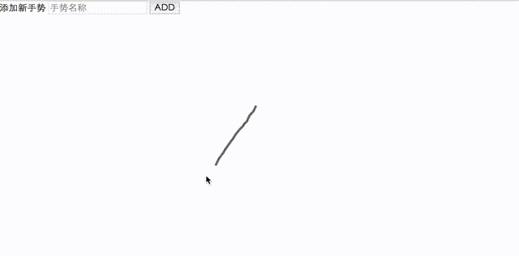

## smart-gesture

这是一个web版的鼠标手势组件，支持普通的鼠标手势和自定义图形手势

#### 普通鼠标手势

普通手势可识别上下左右4个方向的任意组合


#### 自定义图形手势

可识别任意的可以一笔画出的手势,默认有预设的14种图形,同时也能自定义图形。若自定义图形手势,可以通过增加样本集来提高识别率,推荐同一个手势对应2-3个样本集。



#### 调用方法

```
// 这是一个简陋的例子。待发布到npm后可以直接 import createCanvas from 'smart-gesture';
import createCanvas from '../src/main.js';

let lastPoints = [];

const options = {
  el: document.getElementById('test'),  
  enablePath: true,                     
  timeDelay: 500,                        
  onSwipe: (list) => {
    document.getElementById('result0').innerHTML = list.join('');
    console.log(list);
  },
  onGesture: (res, points) => {
    console.log(res);
    document.getElementById('result').innerHTML = res.score > 2 ? res.name : '未识别';
    lastPoints = points;
  }
};

const canvas = createCanvas(options);
```

#### options

##### el
应用手势识别的元素
- type: DOMElement
- 默认值: body

##### enablePath
是否显示鼠标轨迹
- type: Bool
- 默认值: true

##### lineColor
鼠标轨迹的颜色
- type: String
- 默认值: '#666'

##### lineWidth
鼠标轨迹的宽度
- type: Number
- 默认值: 4

##### timeDelay
长按一定时间后才会触发手势识别
- type: Number
- 默认值: 600(ms)

##### triggerMouseKey
触发手势识别的鼠标按键
- type: String
- 默认值: 'right'
- 可选值: 'left', 'right'

##### gestures
初始化自定义图形集合
- type: Array | Object
- 默认值: 所有预设的手势

#### events

##### onSwipe: function(directionList)
手势结束时调用
- directionList: 普通手势的识别结果

  - type: Array

##### onGesture: function(result, points)
手势结束时调用
- result: 自定义图形手势的识别结果

  - type: Object
  - result.name:String: 手势的名称
  - result.score:Number: 匹配的分数

- points: 包含该次手势的轨迹的点的集合

  - type: Array


#### functions

##### addGesture(gesture)
添加自定义图形模板
  - gesture: 自定义图形模板
    - type: Object
    - gesture.name:String: 模板名称
    - gesture.points:Array: 点集合


### TODOS
  - 更灵活的配置项
  - 打包
